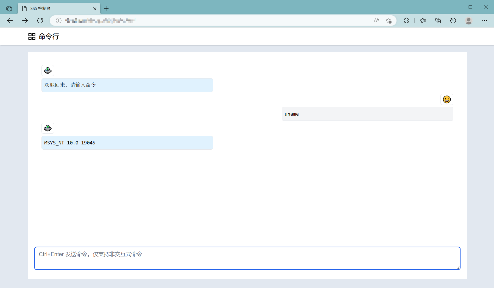
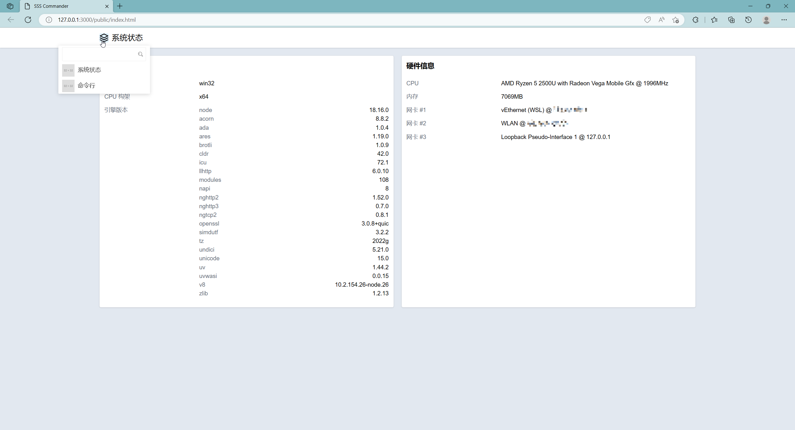

# NAS 控制台

🚧🚧 正在施工 🚧🚧

自用的 NAS 控制台。基于 nodejs、vue。

> 后续会迁移到 bun。bun 自带 sqlite 支持，比较方便。

## 特性

- [ ] 简单的登陆支持
  - [ ] 只支持密码验证
- [x] 支持 APP
  - [x] ~~伪低码开发~~ 简单实现的应用开发支持
    - [x] 应用列表接口
    - [x] 后台支持加载应用的接口
      - [ ] 支持刷新应用列表
    - [x] 前端支持加载远程组件
    - [x] 应用级别的构建支持
  - [ ] 内置应用
    - [x] 应用列表
    - [x] 远程命令行应用
      - [x] 聊天风格 UX
      - [x] 打印机风格的输出效果
    - [ ] Rsync 应用
    - [ ] 快捷方式应用
    - [x] 系统状态应用

## 已知问题

如果用以 root 启动服务，服务器相当于白给别人。这个控制台只考虑内网使用的场景。

### 一些截图

  

  

## LICENSE

MIT
